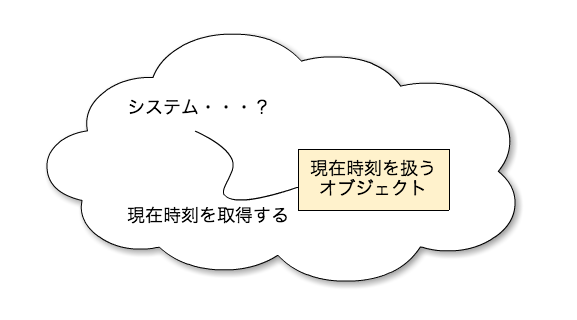
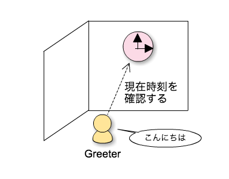
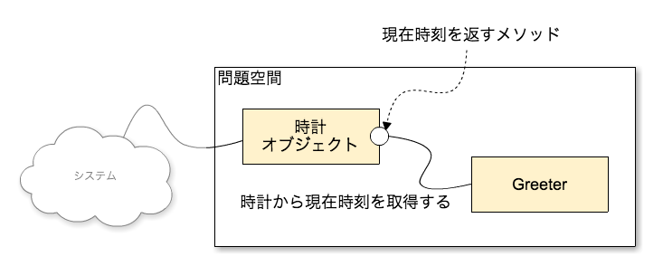
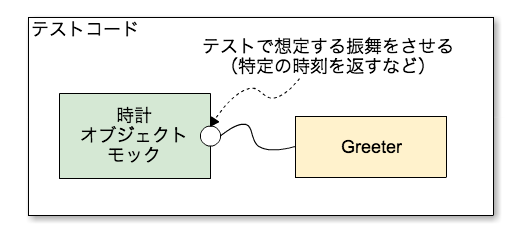
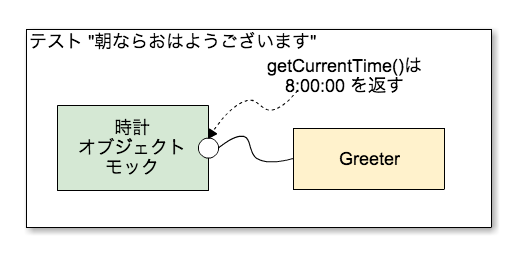
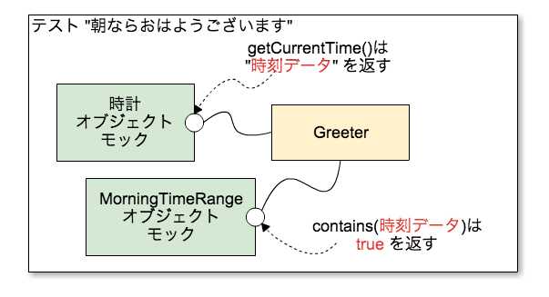
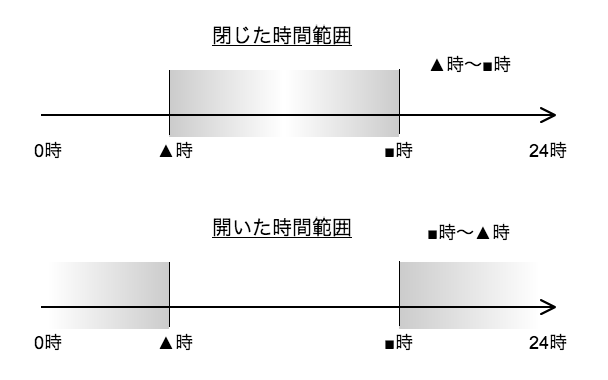
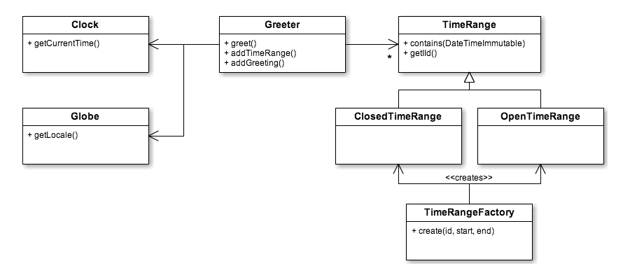

（過去にCodeIQで公開した記事を多少修正、コードは最近のPHP/PHPUnitのものに書き換えてあります）

# PHPUnitでモックを使いながらTDDの練習

以下のような問題をPHPで解答してみます。

- 問1 時間に応じて異なるあいさつをするGreeterを作成する（テスタブルに）
- 問2 Greeterを、ロケールによって異なるあいさつに対応させる（テスタブルに）

次の環境とします。

- PHP 7.1.16
- PHPUnit 7.2
- Composer

サンプルコードのリポジトリはGitHubにて公開しています。
- [github](https://github.com/hidenorigoto/test-greeter)

以降の解説中にコミットへのリンクを記載していますので、手元で写経しながら読み進めることをオススメします。

## この解答例の大きな目的

- オブジェクトによる問題のモデリング過程
- オブジェクトの責務の分割とはどういったことか

これらをTDDを行いながらボトムアップで体験・理解することを目的としています。
この過程で、現在時刻も含めた要素のテスタビリティを高く維持するための手法なども学べます。


## 問題を解く流れ

大枠としてオブジェクト指向のアプローチをとります。つまり、問題をオブジェクトとオブジェクト同士のやりとりで表現するということです。
まずはテストファーストにて進めます。最初は問題をどういうオブジェクトで構成したらよいのか、あまり見えていないというような位置付けとし、今回の問題で中心的な機能である「あいさつをする」の1パターンから取り組んでみましょう。細部から取り組み創発的（emergent）に設計を発見していこうというアプローチです。ある程度TDDで問題に取り組むことで必要なオブジェクトなどが見つかっていきます。多少進んだら、一旦TDDの流れは止め（捨てて）全体の設計に立ち返り、その後、本実装していくという流れだと考えてください。


## 初期ディレクトリ構成

```
├── src
│   └── Greeter.php
├── tests
│   └── GreeterTest.php
```

`src` 配下にプロダクションコード、 `tests` 配下にテストコードを作成していきます。
初期状態を準備するコミットは以下です。

- [composer.jsonを用意](https://github.com/hidenorigoto/test-greeter/commit/c3acf6c3c91dfb48c7f07fe69ffa9aac4acd118f)
- [composer.lockを.gitignoreに追加](https://github.com/hidenorigoto/test-greeter/commit/c2be8cb709999d0eb28d4a634fd8260ccc322ceb)
- [テスト用の設定ファイルの追加、修正](https://github.com/hidenorigoto/test-greeter/commit/483b12936f542e9f2e5b4f2092a77e5172252d90)

準備ができたら、`composer install` を実行してください。
正常に準備ができたら、`vendor/bin/phpunit` で、PHPUnitが実行される状態になっています。

## 最初の機能　おはようございますとあいさつをする

最初の「おはようございます」と返すだけのメソッドのテストを作成し、その実装の記述までは、特に悩むことはありませんね。

```php
<?php
// tests/GreeterTest.php
namespace Hg\Greeter\Tests;

use Hg\Greeter;
use PHPUnit\Framework\TestCase;

class GreeterTest extends TestCase
{
    /**
     * @var Greeter
     */
    public $SUT;

    /**
     * @test
     */
    public function あいさつする()
    {
        $this->assertThat($this->SUT->greet(), $this->equalTo('おはようございます'));
    }

    protected function setUp()
    {
        $this->SUT = new Greeter;
    }
}
```

- [最初のテストケースを追加 [FAIL]](https://github.com/hidenorigoto/test-greeter/commit/0c1caa8e8de9544ff6f7642ca4466bd859c966ae)

このコードだけだと、Greeterクラスがありませんので、テストはエラーになります。Greeterクラスの仮実装を用意しましょう。

```php
<?php
// src/Greeter.php
namespace Hg\Greeter;

class Greeter
{
    public function greet() :string
    {
        return 'おはようございます';
    }
}
```

- [固定のあいさつを返すだけのメソッドを実装 [PASS]](https://github.com/hidenorigoto/test-greeter/commit/f79ea3a635cc8a2a0937d4f32afb5c66fd9b030f)

この段階で `vendor/bin/phpunit` を実行すると、テストはパスするはずです。
以降、コミットごとに `[FAIL]` 、`[PASS]` とつけてあります。これは、そのコミット時のテストが失敗するか成功するかを表しています。
自分でもテストを実行して同じようになるか、都度確認しながら進めてください。

## 「朝ならば」をテスト可能な実装とは？

さて、「朝ならば」という条件によって動作を変える部分に早速取り組む必要が出てきました。時刻によって動作が変わるわけです。テストで時刻を扱いやすくする目的を達成する方法として、おそらく最初に思いつくのは「メソッドの引数で渡せるようにする」ではないでしょうか。

```php
// src/Greeter.php
public function greet(\DateTimeInterface $currentTime) :string
{
    if ($currentTimeが朝なら) {
    return 'こんにちは';
}
```

こうすれば、テストしたい時間をテスト側でコントロールできます。

```php
// tests/GreeterTest.php
public function あいさつする()
{
    $currentTime = new \DateTimeImmutable('08:00:00');
    $this->assertThat($this->SUT->greet($currentTime), $this->equalTo('おはようございます'));
}
```

しかし、テストしたいという目的のためだけにプロダクションコードのメソッドシグニチャを変更するのは得策ではありません。また、時刻に影響するいろいろなメソッドで現在時刻の値を渡して回らないといけなくなります。後者の問題を回避しようと、次のように引数をオプショナルにして、渡されていない場合はメソッド内で現在時刻を生成するようにすればよいでしょうか？

```php
// src/Greeter.php
public function greet(\DateTimeInterface $currentTime = null) :string
{
    $currentTime = $currentTime ?: new \DateTimeImmutable();
    …
}
```

テストもでき、プロダクションコード側では現在時刻を引数で毎回渡す必要もなくなり、素直に実装していけるようになった。。。。のでしょうか？
「テストのためだけのメソッドシグニチャ」問題は依然として残っています。メソッド本来の目的には関係のないものがシグニチャに入っていると、後々そのメソッドの使い方を混乱させることにつながってしまいます。たとえば人とあいさつをする時に、「今8時ですね、おはようございます」とは声をかけませんよね。今何時なのかといったコンテキストは、あいさつをするオブジェクトが事前に知っている・判断できることで、「あいさつする」ということに対して直接渡すパラメータではないわけです。


## オブジェクトの振る舞いで表現する

では、あいさつをするオブジェクトがコンテキストから現在時刻を取得するとはどういうことなのでしょうか？
単純には、図1のようにオブジェクト自身がシステムから現在時刻を取得することです。

＜図1 システムから現在時刻を取得する＞


しかし、オブジェクトのメソッド内で直接現在時刻を取得すると、現在の目標である「テストをしながら実装」ということができません。プロダクションコードのメソッド内で直接現在時刻をインスタンス化していれば、テストコードから時刻をコントロールできなくなるためです。別の言い方をすると、「現在時刻を取得する行為」が、「オブジェクトの振る舞い」として表現されていないからとも言えます。
図2を見てください。

＜図2 時計を見て現在時刻を確認する＞


私たちがあいさつをする時、部屋に時計があれば、その時計を見て現在時刻を確認するかもしれません。もしくは多くの人は「体内時計」からおおよその時刻を判断してあいさつをしているかもしれません。いずれにしても、何らかの「時計」から時刻を取得していると考えると自然です。この自然な形をソフトウェアに持ち込みます。つまり、私たちが考えている問題の中に明示的に「時計」という概念（オブジェクト）を登場させます（図3）。時計オブジェクトには「現在時刻を返す」という振る舞いを持たせます。テストの場合は時計オブジェクトをモックで置き換えて、テストで意図したように振る舞わせることができます（図4）。

＜図3 時計オブジェクトを使うプロダクションコード＞


＜図4 テスト時にモックに置き換える＞



- 問題空間に明示的に時計があるように考えることはさまざまな場面で有用で、PHPメンターズではこれは「ドメインクロックパターン」と呼んでいます。 http://phpmentors.jp/post/46982737824
- ドメインクロック（時計オブジェクト）は問題空間に実体が1つあります。扱う問題ごとに異なる要求があるでしょう。PHPUnitではモックオブジェクトを作るのにインターフェイスは不要なことも合わせて、単純にこの問題専用の具象クラスを用意します。


## 時計オブジェクトを使うように修正

今回の問題では「現在時刻を取得する」ための時計が欲しいので、1つだけメソッドを持つClockクラスを次のように作成します。

```php
<?php
// src/Clock.php
namespace Hg\Greeter;

class Clock
{
    /**
     * @return \DateTimeInterface
     */
    public function getCurrentTime() :\DateTimeInterface
    {
        return new \DateTimeImmutable();
    }
}
```

- [時計オブジェクトのクラスを追加 [PASS]](https://github.com/hidenorigoto/test-greeter/commit/b96d0aec78a94de52adfd093abde369de5922ece)

このメソッドはほぼgetterですから、テストは不要ですね。
Greeterがこの時計オブジェクトを＊使って＊現在時刻を取得するようにします。ここで、依存性注入パターンを用います。Greeterにとって、時計はすでにその場にあって利用するだけなのです。時計を利用するためにわざわざ時計をその場で自分で組み立てるということをしないのと同じです。「誰が時計を作るのか」「誰が時計をくれるのか」は一旦考えないことにし、コンストラクタインジェクションにより時計オブジェクトを受け取って利用するように修正します。

```php
// src/Greeter.php
class Greeter
{
    /**
     * @var Clock
     */
    private $clock;

    public function __construct(Clock $clock)
    {
        $this->clock = $clock;
    }
```

- [時計オブジェクトをGreeterのコンストラクタで受け取るように修正 [FAIL]](https://github.com/hidenorigoto/test-greeter/commit/9f4e2c96a0da91bd547d6204c728f5c8b9c96c96)

テストコード側では、テスト用のコンテキストのセットアップ時に時計オブジェクトのモックを用意します。それを `SUT` （= Greeterオブジェクト）に渡すようにしておきます。

```php
// tests/GreeterTest.php
class GreeterTest extends TestCase
{
    ...

    /**
     * @var Clock
     */
    private $clock;

    ...

    protected function setUp()
    {
        $this->clock = $this->getMockBuilder(Clock::class)->getMock();
        $this->SUT   = new Greeter($this->clock);
    }
}
```

- [テストで時計オブジェクトのモックを使う準備 [PASS]](https://github.com/hidenorigoto/test-greeter/commit/ebe1cbab06868d4d112443e6936a9241a6cb823e)

ようやく現在時刻を使う準備ができました。


## モックによりテストから現在時刻を変えて朝かどうかを実装する

テストコードで「朝なら」という条件を実装できますね。ここでは一旦「朝ではない場合は、空文字列が返される」ということにして、テストケースを2つに増やします。モックによって、時計から '08:00:00' という値が返されるようにしています（図5）。
PHPUnitのモック機能の使い方については、PHPUnitのリファレンスを参照してください。(http://phpunit.de/manual/3.7/ja/test-doubles.html)

＜図5 モックに08:00:00を返すよう振る舞わせる＞


```php
// tests/GreeterTest.php
class GreeterTest extends TestCase
{
    ...

    /**
     * @test
     */
    public function 朝ならおはようございます()
    {
        $this->clock->expects($this->once())
            ->method('getCurrentTime')
            ->willReturn(new \DateTimeImmutable('08:00:00'));

        $this->assertThat($this->SUT->greet(), $this->equalTo('おはようございます'));
    }

    /**
     * @test
     */
    public function 朝でないならあいさつなし()
    {
        $this->clock->expects($this->once())
            ->method('getCurrentTime')
            ->willReturn(new \DateTimeImmutable('15:00:00'));

        $this->assertThat($this->SUT->greet(), $this->equalTo(''));
    }
```

- [時計オブジェクトのメソッドをモックして朝とそれ以外のテストを追加 [FAIL]](https://github.com/hidenorigoto/test-greeter/commit/7acddce7a0e78e567b392687fb9aea76760acf50)

メソッドをモックしたので、実際にこのメソッドの呼び出しがなければテストはパスしません（モックの `expects()` により呼び出しが1回あることを検証しているため）。時刻の判定も含めてテストをパスするようにプロダクションコードを実装しましょう。

```php
// src/Greeter.php
class Greeter
{
    ...

    public function greet() :string
    {
        $currentTime = $this->clock->getCurrentTime();
        if ($currentTime >= new \DateTimeImmutable('05:00:00') &&
            $currentTime < new \DateTimeImmutable('12:00:00')
        ) {
            return 'おはようございます';
        }

        return '';
    }
```

- [時計オブジェクトから現在時刻を取得して、直接朝の時間帯を判定するようにした [PASS]](https://github.com/hidenorigoto/test-greeter/commit/241e9207e40ef76692a18fbbadd84eca4ee806f9)

この実装でテストはパスします。
これで、テストをしながら「朝ならおはようございますとあいさつする」と動作させるところまできました。
1つ目の機能が実装できたので、次はこの実装をリファクタリングできないかを検討してみます。


## プロダクションコードのリファクタリング：意図の反映

すぐに気づくのは、`greet()` メソッドで朝かどうかを判定する条件文に時刻が直接埋め込まれていることや、それも含めて条件がやや複雑に見えることでしょう。 `greet()` メソッドに書かれているコードを前提知識のない別のプログラマが読んだ時に、この条件が時刻を使って何らかの判定を行っていることは分かりますが、それが「朝かどうか」という判定を意図していることまではコードからは読み取れません。「もともとプログラマが意図していたこと、考えていたこと」を別のプログラマが素直に読み取れるコードの方が、理解しやすくメンテナンスしやすいコードと言えます（インテンショナリティが高いといいます）。

> 表現に富む
>・・・
 > ソフトウェアプロジェクトにおけるコストの大半は、長い期間に渡る保守に費されます。変更を行うときに不具合を混入してしまう可能性を最小化するには、システムの動作を理解可能とすることが重要です。システムが複雑化するにつれ、それを理解するのにより時間が必要となり、誤解が生じる可能性が増大していきます。そのため、**コードには、書き手の意図が明快に表現されている必要があります**。書き手の意図の表現が明快であればあるほど、別の人がそれを理解するのに必要な時間は減少します。これは不具合を減らし保守コストを低減させます。
 >・・・
 >   Robert C. Martin著『Clean Code』 p.234
 >   （強調は引用者による）

`greet()`メソッドに戻ると、ここでは「時刻が朝かどうか」を比較することを意図していますから、それをそのまま表現したメソッドに条件を抽出しましょう。
『リファクタリング』では条件記述の分解にあたります。

```php
// src/Greeter.php
class Greeter
{
    ...

    public function greet() :string
    {
        $currentTime = $this->clock->getCurrentTime();
        if ($this->timeIsMorning($currentTime)) {
            return 'おはようございます';
        }
    }

    /**
     * @param \DateTimeInterface $currentTime
     * @return bool
     */
    private function timeIsMorning(\DateTimeInterface $currentTime) :bool
    {
        return $currentTime >= new \DateTimeImmutable('05:00:00') &&
            $currentTime < new \DateTimeImmutable('12:00:00');
    }
```

- [朝ならの条件をメソッドに抽出した [PASS]](https://github.com/hidenorigoto/test-greeter/commit/a13090d899c2ebaef443a061fe6d40793f9c292f)

メソッドを抽出しただけですから、テストはパスします。

抽出した`timeIsMorning()`メソッドに着目します。privateメソッドとして抽出しましたが、このメソッドが表す「朝なら」という条件は問題文にもあらわれている重要な要素です。greet()メソッドから内部的に利用される実装の詳細といった位置付けではありません。少なくともpublicメソッドに格上げする必要があります。
次にGreeterオブジェクトの持つ責務について考えてみましょう。あいさつをするための`greet()`メソッドと、朝かどうかを判定する`timeIsMorning()`メソッドがあります。現在の問題ではGreeterオブジェクトが`timeIsMorning()`メソッドを持っていることが責務過剰かどうかを判断する材料が多くありません。少し想像力を働かせて、たとえばGreeterオブジェクトとは別に、「朝ならさわやかなBGMを流す音楽プレイヤー」が同じ問題空間にあって機能として実装しなければならないと想像してみてください。音楽プレイヤーが朝かどうかを判定するために、Greeterオブジェクトに問い合わせるのでしょうか？ または音楽プレイヤーオブジェクトにも朝かどうかを判定するメソッドを持たせるのでしょうか？


## 判定オブジェクトの発見

ここはソフトウェアのモデルなので抽象化して考えることが前提ですが、「朝かどうか」を判定する装置のような概念が1つ必要そうです。Greeterも音楽プレイヤーも、この「朝かどうか」判定装置に問い合わせると考えれば、しっくりきませんか？（現実世界のモノではありませんが、私たちが「朝」と呼んでいるものをモデル化したもの、朝という仕様のようなイメージです）
朝かどうかは、今回の問題では開始時刻と終了時刻により判定することになります。時間の範囲の1つの具象を私達は「朝」と呼んでいるわけですね。

この概念をコードに導入してみましょう。「朝」という時間範囲を`MorningTimeRange`オブジェクトとして表します。「朝かどうか」は、「朝という時間範囲に含まれるかどうか」と言い換えることができますので、`contains()`というメソッドに現在時刻を渡して判定できるようにします。なお、これは『リファクタリング』のクラスの抽出ですから、MorningTimeRangeの`contains()`メソッドの実装は現時点でほぼ分かっています。しかし一旦単純な実装としてクラスを作ってそれを利用する準備とテストを用意してから、メソッドの中身を実装するというステップで進んでいきましょう。

```php
<?php
// src/MorningTimeRange.php
namespace Hg\Greeter;

class MorningTimeRange
{
    public function contains(\DateTimeInterface $target) :bool
    {
        return true;
    }
}
```

- [朝時間範囲の仮実装を追加 [PASS]](https://github.com/hidenorigoto/test-greeter/commit/299b13f16fe53e70434f33ae1050ec512957e4d4)

## MorningTimeRangeオブジェクトのテストと実装

MorningTimeRangeのcontains()メソッドは入出力の仕様が明確です。理想形ではありませんが、ここではPHPUnitのデータプロバイダを用い検証用データマトリックスを使ってテストすることにしましょう。

```php
<?php
// tests/MorningTimeRangeTest.php
namespace Hg\Greeter\Tests;

use Greeter\MorningTimeRange;
use PHPUnit\Framework\TestCase;

class MorningTimeRangeTest extends TestCase
{
    /**
     * @var MorningTimeRange
     */
    private $SUT;

    /**
     * @test
     * @dataProvider 時間帯テストデータ
     */
    public function 時間帯に含むかどうか($target, $expected)
    {
        $this->assertThat(
            $this->SUT->contains(new \DateTimeImmutable($target)),
            $this->equalTo($expected)
        );
    }

    public function 時間帯テストデータ()
    {
        return [
            ['04:00:00', false],
            ['05:00:00', true],
            ['10:00:00', true],
            ['12:00:00', false],
            ['20:00:00', false],
        ];
    }

    protected function setUp()
    {
        $this->SUT = new MorningTimeRange();
    }
}
```

- [朝時間範囲の検証テストを追加した [FAIL]](https://github.com/hidenorigoto/test-greeter/commit/2c895947e464704833c4b8d9bca824d52b353d55)

このテストがパスするように`contains()`メソッドを実装します。もともとGreeterにあった`timeIsMorning()`メソッドの条件をほぼそのまま利用すればよいですね。

```php
// src/MorningTimeRange
class MorningTimeRange
{
    public function contains(\DateTimeInterface $target) :bool
    {
        return $target >= new \DateTimeImmutable('05:00:00') &&
            $target < new \DateTimeImmutable('12:00:00');
    }
```

- [朝時間範囲の検証テストを追加した [FAIL]](https://github.com/hidenorigoto/test-greeter/commit/2c895947e464704833c4b8d9bca824d52b353d55)

これでMorningTimeRangeのテストはパスします。


## MorningTimeRangeを使ってGreeterを書き換え

次は、MorningTimeRangeを利用するようにGreeter本体を書き換えましょう。ここでもDIを使います。

```php
// src/Greeter.php
class Greeter
{
    ...

    /**
     * @var MorningTimeRange
     */
    private $morningTimeRange;

    public function __construct(Clock $clock, MorningTimeRange $morningTimeRange)
    {
        $this->clock = $clock;
        $this->morningTimeRange = $morningTimeRange;
    }
```

MorningTimeRangeはテスト済みのオブジェクトですから、Greeterのテストでは一旦実物をそのまま使うようにしましょう。setUp()でインスタンス化してGreeterのコンストラクタへ渡します。

```php
// tests/GreeterTest.php
class GreeterTest extends TestCase
{
    ...

    /**
     * @var MorningTimeRange
     */
    private $morningTimeRange;

    ...

    protected function setUp()
    {
        ...
        $this->morningTimeRange = $this->getMockBuilder(MorningTimeRange::class)->getMock();
        $this->SUT              = new Greeter($this->clock, $this->morningTimeRange);
    }
```

- [MorningTimeRangeをDIするように修正した [PASS]](https://github.com/hidenorigoto/test-greeter/commit/53e358c94b39f5915087cdd719de719b4232f16c)

テストがパスすることを確認したら、MorningTimeRangeを使うようにGreeterの`greet()`メソッドを修正します。

```php
class Greeter
{
    ...

    public function greet() :string
    {
        $currentTime = $this->clock->getCurrentTime();
        if ($this->morningTimeRange->contains($currentTime)) {
            return 'おはようございます';
        }
    }
```

    (timeIsMorning()メソッドは削除)

- [注入されたMorningTimeRangeを使って判定を行なうように修正した [FAIL]](https://github.com/hidenorigoto/test-greeter/commit/d52ea9681d5fb86e1024f04b8b8dc2d376382ff1)

これだけだとテストは失敗になります。テスト側でMorningTimeRangeのメソッド呼び出しのモックを記述していないためです。テストを修正しましょう。

```php
// tests/GreeterTest.php
class GreeterTest extends TestCase
{
    ...
    public function 朝ならおはようございます()
    {
        $this->clock->expects($this->once())
            ->method('getCurrentTime')
            ->willReturn($current = new \DateTimeImmutable('08:00:00'));
        $this->morningTimeRange->expects($this->once())
            ->method('contains')
            ->with($current)
            ->willReturn(true);
    :
}
```

- [モックしたMorningTimeRangeのcontains()の振る舞いをテストケースに合わせて追加 [PASS]](https://github.com/hidenorigoto/test-greeter/commit/e106d07b1524eb5b9924a6db0705fbb1a2e5675f)

これでテストはパスします。
プロダクションコードのリファクタリングが一段落しました。


## モックによってテストコードの抽象度を上げる

Greeter側ではMorningTimeRangeを導入することで「朝かどうか」という条件の判定の詳細を切り離すことができました。「朝かどうか」という条件を抽象化し、現在時刻が範囲に含まれるかどうかという判定結果のみに関心があります。個別の時間による判定の知識はMorningTimeRangeへ移動させたので、個別の時間に関する動作はMorningTimeRangeのテストで検証します。つまり、Greeterのテストでは個別の時間に関係する振る舞いには触れたくありません。
先程のコミットで、GreeterのテストコードでMorningTimeRangeもモックオブジェクトとして作成するように変更し、contains()メソッドの振る舞いを差し替えました。
この段階でテストコードの中身は図6のようになっています。

＜図6 MorningTimeRangeのモックを使ってテスト＞



- 時刻データを返す時計オブジェクト
- 時刻データを受け取りtrueを返すMorningTimeRangeオブジェクト
- この2つを使い、MorningTimeRangeの結果によってあいさつを返すGreeterオブジェクト

この3つで構成されています。テストコードに具体的な現在時刻があらわれていないことに着目してください（"時刻データ" の中身に依存しなくなっています）。

朝ではない場合も同様に書き換えることで、テストはパスします。

ここまでで、

- 1つの機能の実装
- プロダクションコードのリファクタリング
- テストのリファクタリング

を行いました。GreeterとMorningTimeRangeに責務を分割し、プロダクションコードの責務分割／抽象化に合わせてテストコードもそれぞれ対象となっている責務のみをテストするようリファクタリングしました。一度説明しましたが、PHP/PHPUnitではインターフェイスを作らなくてもモックによるテストが可能ですので、テストの目的だけのインターフェイスの導入はしていません。しかし設計的観点ではGreeterは「朝かどうか」を判定する抽象的なものにのみ依存するようにしたということにほかなりません。変更に強いクラス設計のための原則であるSOLID原則の中でも、次の2つを適用したことになります。

- 利用オブジェクトの抽象にのみ依存するようにし、具象に依存してはならない（依存関係逆転の原則：DIP）
- オブジェクトの変更理由が複数あってはならない（単一責任の原則：SRP）


## 前半の総括：テストの基礎としてはここまでが超重要

当初の問題としては、まだごく一部しか解決していませんが、キーとなる概念とそれを支えるための仕組みはここまでで完成しています。
これ以降は、設計を成長させていくだけです。設計を成長させていく過程で、ここまでで解説した概念・手法・パターンを繰り返し使っていくことになります。
ですから、ここまでで解説している基本がしっかり身けることが重要です。
GitHubで公開しているコードは、この記事の手順に沿ってコミットを作ってあります。この記事とコミットログを見ながら、実際に自分でコードを書いていくことで、より深く理解できるはずです。


## 問1の完成

さて、問1の問題を解くためにはさらにどういった設計が必要でしょうか。

- 朝かどうか、以外の条件が増える（昼、夜）
- 朝かどうかは、本質としては「時間の範囲に入っているかどうか」であった。朝でも昼でも、時間の範囲に入っているかという共通の仕組み。
- 深夜0時をまたぐ時間範囲も存在する
- 0時をまたぐ時間範囲、0時をまたがない時間範囲

このように考えを進めると、抽象的な「時間範囲」概念があり、具体的には「閉じた時間範囲」と「開いた時間範囲」にモデル化できます（図7）。

＜図7 閉じた時間範囲、開いた時間範囲＞


- TimeRange (抽象クラス）
- OpenTimeRange
- ClosedTimeRange

これ以降は実装の一部のみを掲載します。すべてのコードはGitHubのリポジトリを参照してください。

- [時間範囲の抽象クラスを追加 [PASS]](https://github.com/hidenorigoto/test-greeter/commit/5c53d03da54da80be6849fb6dbd85ff2a5845dce)
- [閉じた時間範囲の仮実装と、テストの追加 [FAIL]](https://github.com/hidenorigoto/test-greeter/commit/b8a3b84e7f110620f973ab12460eae7e67df1b90)
- [閉じた時間範囲のcontains()を実装 [PASS]](https://github.com/hidenorigoto/test-greeter/commit/3dae348261fd1bdfe69f33e0f5d698f97853f5f4)
- [OpenTimeRangeの実装とテストを追加 [PASS]](https://github.com/hidenorigoto/test-greeter/commit/d78aaa9564a753ffcdb9d388dd23f1ac21b1d1fa)

```php
<?php
// src/ClosedTimeRange.php
namespace Hg\Greeter;

class ClosedTimeRange extends TimeRange
{
    /**
     * @param \DateTimeInterface $target
     * @return bool
     */
    public function contains(\DateTimeInterface $target) :bool
    {
        return $this->first <= $target && $target < $this->second;
    }
}
```

もともとMorningTimeRangeをテストしていたのと同じようにデータプロバイダを使ったテストを記述します。

```php
<?php
// tests/ClosedTimeRangeTest.php
namespace Hg\Greeter\Tests;

use CodeIQ\Greeter\ClosedTimeRange;
use PHPUnit\Framework\TestCase;

class ClosedTimeRangeTest extends TestCase
{
    /**
     * @test
     * @dataProvider 時間帯テストデータ
     */
    public function 時間帯に含むかどうか($first, $second, $target, $expected)
    {
        $timeRange = new ClosedTimeRange('',
            new \DateTimeImmutable($first),
            new \DateTimeImmutable($second));

        $this->assertThat($timeRange->contains(new \DateTimeImmutable($target)),
            $this->equalTo($expected));
    }

    public function 時間帯テストデータ()
    {
        return [
            '時間帯の前'         => ['04:00:00', '10:00:00', '02:00:00', false],
            '時間帯の開始と同一' => ['04:00:00', '10:00:00', '04:00:00', true],
            '時間帯の中'         => ['04:00:00', '10:00:00', '05:00:00', true],
            '時間帯の終了と同一' => ['04:00:00', '10:00:00', '10:00:00', false],
            '時間帯の後'         => ['04:00:00', '10:00:00', '12:00:00', false],
        ];
    }
}
```

> TIPS データプロバイダの各データに連想配列のキーを指定すると、テストの実行結果が分かりやすくなります。

時間範囲は0時をまたぐ場合とそうでない場合とでOpenTimeRangeを使うのか、ClosedTimeRangeを使うのかが決まります。この使い分けの責務はTimeRangeFactoryとして実装します。

- TimeRangeFactory
- [時間範囲を作り分けるファクトリとそのテストを追加 [PASS]](https://github.com/hidenorigoto/test-greeter/commit/50c0270ff392bba9cae49eda723eeec7ed7a7b62)
- [Greeterを複数TimeRange化し、合わせてテストを修正した [PASS]](https://github.com/hidenorigoto/test-greeter/commit/b93489fbad321efe5971fef46c74fb6daa8b864e)

Greeter自体は、「時間範囲ごとのあいさつ」の構成を外から知識として与えられるようにします。最終的には、コンテキストを作り上げるためのアプリケーションスクリプトを用意し、そこにコンテキストのコンフィギュレーションをまとめます。

- app.php
- [Greeterのコンテキストを構成して実行するアプリケーションスクリプトを追加した [PASS]](https://github.com/hidenorigoto/test-greeter/commit/e2885670516034298abea1d9f9d6afdc441f9fd0)

## 問1のGreeterとアプリケーションスクリプト

Greeterは時間範囲ごとのあいさつの知識の構成をaddTimeRangeAndgreeting()で行い、その知識をもとに、greet()メソッドであいさつを返すようになりました。

```php
<?php
// src/Greeter.php
namespace Hg\Greeter;

class Greeter
{
    /**
     * @var Clock
     */
    private $clock;
    /**
     * @var array
     */
    private $timeRangeAndGreetings;

    function __construct(Clock $clock)
    {
        $this->clock = $clock;
        $this->timeRangeAndGreetings = [];
    }

    public function addTimeRangeAndGreeting(TimeRange $timeRange, $greeting)
    {
        $this->timeRangeAndGreetings[] = ['range' => $timeRange, 'greeting' => $greeting];
    }

    public function greet() :string
    {
        $currentTime = $this->clock->getCurrentTime();
        foreach ($this->timeRangeAndGreetings as $timeRangeAndGreeting)
        {
            if ($timeRangeAndGreeting['range']->contains($currentTime))
            {
                return $timeRangeAndGreeting['greeting'];
            }
        }

        return '';
    }
}
```

```php
<?php
// app.php
require_once __DIR__.'/vendor/autoload.php';

use Hg\Greeter\Clock;
use Hg\Greeter\Greeter;
use Hg\Greeter\TimeRangeFactory;

$clock   = new Clock();
$greeter = new Greeter($clock);

$timeRange = new TimeRangeFactory();
$greeter->addTimeRangeAndGreeting($timeRange->create(
        'morning', '05:00:00', '12:00:00'
    ), 'おはようございます');
$greeter->addTimeRangeAndGreeting($timeRange->create(
        'afternoon', '12:00:00', '18:00:00'
    ), 'こんにちは');
$greeter->addTimeRangeAndGreeting($timeRange->create(
        'night', '18:00:00', '05:00:00'
    ), 'こんばんは');

echo $greeter->greet();
```

- [MorningTimeRangeは不要なので削除 [PASS]](https://github.com/hidenorigoto/test-greeter/commit/f581b02289ae09681c37e2b6ee8755214699a7fa)

## 問2「ロケール」

問2ではロケールの仕様が入ります。タイムゾーンとの関係は考慮しないということですから、単純に返されるあいさつのみに作用する仕様が追加されるということですね。
問1で現在時刻に対して「ドメインクロック」を導入しました。同じように、現在どの国にいるのかを知るための概念として、ここでは「地球儀」を導入します。正直なところ、この「地球儀」という概念・言葉はややしっくりきておりませんが、一旦この概念をオブジェクトとしてモデルに登場させて進めることにします。Globeクラスを次のように作成します。

```php
<?php
// src\Globe.php
class Globe
{
    public function getLocale()
    {
        return 'ja';
    }
}
```

- [地球儀クラスを追加した [PASS]](https://github.com/hidenorigoto/test-greeter/commit/4231676493cf572655e3645a2bb299049307146c)

`getLocale()` メソッドの戻り値はロケールID(2文字)文字列とします。
ロケールによってあいさつの出力が変化する動作は、どのように組み込めばよいでしょうか。問1のモデルでは、時間範囲とあいさつ文字列を1対1で直接結びつけていましたが、問2では、同じ時間範囲でもロケールという新しいパラメータによって出力が変化します。問題を解くための処理を2段階に分けて考えることにします。

- (現在時刻) → (時間範囲)
- (時間範囲, ロケール) → (あいさつ)

「時間範囲」は "morning" "afternoon" "night" のようにその時間帯を抽象的に表す文字列を使うことにしましょう。また、現在時刻とロケールからあいさつを決定するのは、連想配列を使ってダイレクトに解決します。


## 完成形

Greeterでは、時間範囲の判定処理をprivateメソッドへ抽出しています。

```php
<?php
// src/Greeter.php
namespace Hg\Greeter;

class Greeter
{
    /**
     * @var Clock
     */
    private $clock;
    /**
     * @var Globe
     */
    private $globe;
    /**
     * @var array
     */
    private $timeRanges;
    /**
     * @var array
     */
    private $greetings;

    public function __construct(Clock $clock, Globe $globe)
    {
        $this->clock      = $clock;
        $this->globe      = $globe;
        $this->timeRanges = [];
        $this->greetings  = [];
    }

    public function addTimeRange(TimeRange $timeRange)
    {
        $this->timeRanges[] = $timeRange;
    }

    public function addGreeting(string $locale, string $timeRangeId, string $greeting)
    {
        $this->greetings[$locale][$timeRangeId] = $greeting;
    }

    public function greet() :string
    {
        $currentTime   = $this->clock->getCurrentTime();
        $timeRangeId   = $this->decideTimeRange($currentTime);
        $currentLocale = $this->globe->getLocale();

        if (isset($this->greetings[$currentLocale][$timeRangeId])) {
            return $this->greetings[$currentLocale][$timeRangeId];
        }

        return '';
    }

    private function decideTimeRange($currentTime)
    {
        foreach ($this->timeRanges as $timeRange) {
            if ($timeRange->contains($currentTime)) {
                return $timeRange->getId();
            }
        }

        throw new \LogicException('Uncovered time range:' . $currentTime->format('H:i'));
    }
}
```

- [Greeterの実装をロケールに対応させた [FAIL]](https://github.com/hidenorigoto/test-greeter/commit/410038dcb860dd8fa95607db943dfac3e175e5ce)
- [dataProviderを使ってロケールパラメータの可変についてもテストできるようにした [PASS]](https://github.com/hidenorigoto/test-greeter/commit/31512b769abd37bf9dca58266a5ff89d71cf4601)

アプリケーションスクリプトにて、今回の問題を構成しています。時間範囲の構成とロケールごとのあいさつの構成の2段階になっています。

```php
<?php
// app.php
require_once __DIR__.'/vendor/autoload.php';

use Hg\Greeter\Clock;
use Hg\Greeter\Globe;
use Hg\Greeter\Greeter;
use Hg\Greeter\TimeRangeFactory;

$clock   = new Clock();
$globe   = new Globe();
$greeter = new Greeter($clock, $globe);

$timeRange = new TimeRangeFactory();
$greeter->addTimeRange($timeRange->create(
        'morning', '05:00:00', '12:00:00'
    ));
$greeter->addTimeRange($timeRange->create(
        'afternoon', '12:00:00', '18:00:00'
    ));
$greeter->addTimeRange($timeRange->create(
        'night', '18:00:00', '05:00:00'
    ));

$greeter->addGreeting('ja', 'morning',   'おはようございます');
$greeter->addGreeting('ja', 'afternoon', 'こんにちは');
$greeter->addGreeting('ja', 'night',     'こんばんは');
$greeter->addGreeting('en', 'morning',   'Good morning');
$greeter->addGreeting('en', 'afternoon', 'Good afternoon');
$greeter->addGreeting('en', 'night',     'Good evening');

echo $greeter->greet();
```

- [appをロケール対応に修正](https://github.com/hidenorigoto/test-greeter/commit/030dfda960360d3b78c4c729b89a5287423336d1)

## モデル

＜図8 問2完成後のクラス図＞


## 最後に

今回は、問題を解くためのモデルをあらかじめコンフィギュレーションし、それに対して現在時刻やロケールを入力として与えて問題を解くという基本スタイルをとりました。しかし、パラメータによってはコンフィギュレーションの段階で固定化できる場合もあります。可変性がどういったスコープで必要なのかを考慮し、適切な位置へ分離・局所化することで、モデルをシンプルにすることができます。問題を解くためのオブジェクト構造を準備する「コンフィギュレーション」の段階と、構成されたオブジェクトを使って問題を解く処理を実際に実行する「実行」段階に分けることは、オブジェクト指向で問題を解く際に基礎となるアーキテクチャです。
問題を解くためのアーキテクチャや指針を持っていれば、未知の問題に遭遇した場合に「まずなにをすればよいのか」が定まり、最初の一歩を踏み出すことが容易になります。TDDを適用する場合でも、やみくもに思いついた箇所からスタートしていては永久にゴールにたどりつきません。アプリケーションにとって重要なユースケースを見極めてから取り組むなど、全体を俯瞰する設計的な視点は必ず必要になります。
ものごとを抽象化して扱う、抽象化した振る舞いをコードにする。抽象化指向が身に付けば、モックを使った振る舞い指向のTDD、もともとの意味での振舞駆動開発ができるようになるでしょう。

# 参考

- [PHPUnit テストダブル](https://phpunit.readthedocs.io/ja/latest/test-doubles.html)
